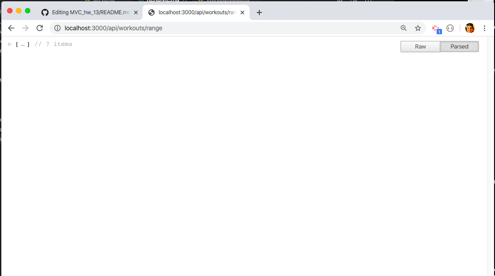

# Mongoose_workout_tracker
Homework #17 -- Mongo DB, Mongoose, Express

## Heroku Deployed Application
https://gentle-atoll-02332.herokuapp.com/

### GH Pages URL: https://pmahalan.github.io/Mongoose_workout_tracker/

The purpose of this assignment was to create a full-stack web application which references a NoSQL database -- specifically, Mongo DB. I acheived this through the use of the node.js package "Mongoose". Through this web application, the documents stored in Mongo DB are varying workouts. Each workout consists of a date on which it takes place, as well as varying apsects of sub-exercises (i.e. duration, reps, sets, distance, type, and time spent). 

The user-end aspects of the application include the ability for users to (1) create brand-new workouts (which are then stored in the server-side database), as well as (2) the ability to update existing workouts by addition additional dates and exercise aspects to that workout. Furthermore, specific URLs allow users to view their workout data in multiple types of ways; "http://localhost:3000/api/workouts/range" allows users to view only the 7 most recent workouts, and "http://localhost:3000/stats" allows users to view their workout history with visual aids such as bar graphs and pie charts.

